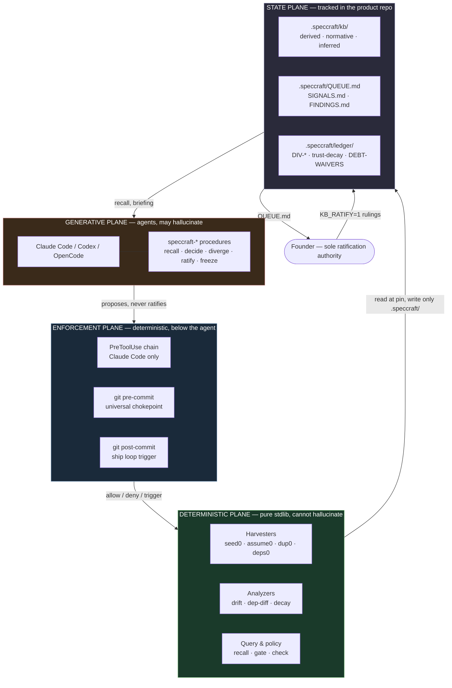
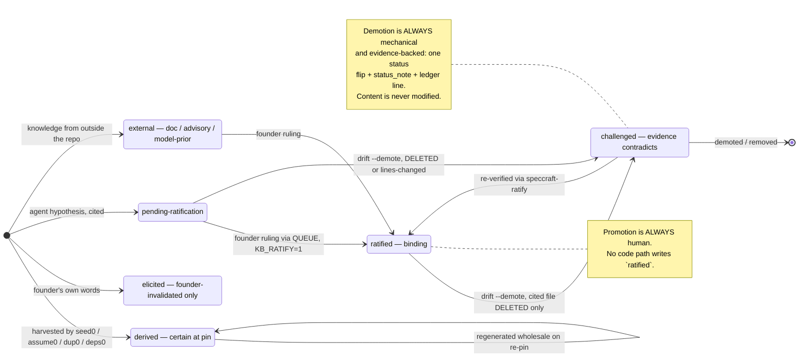
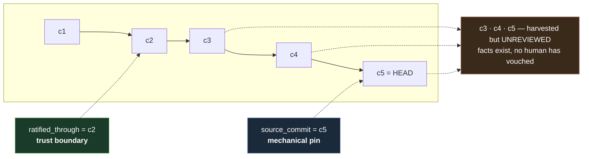
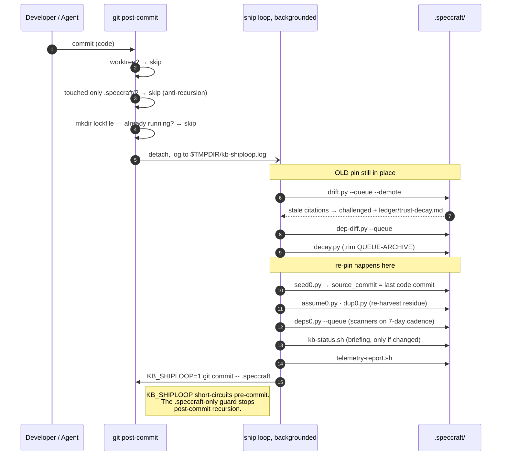
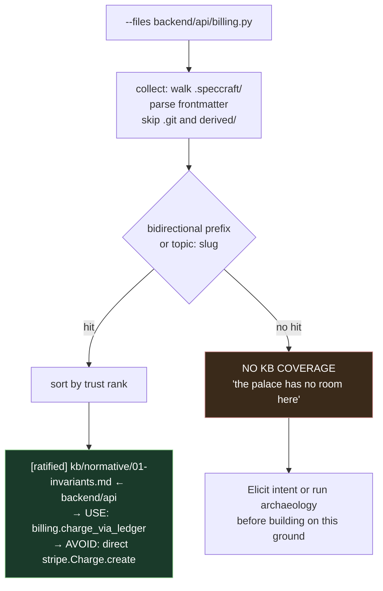
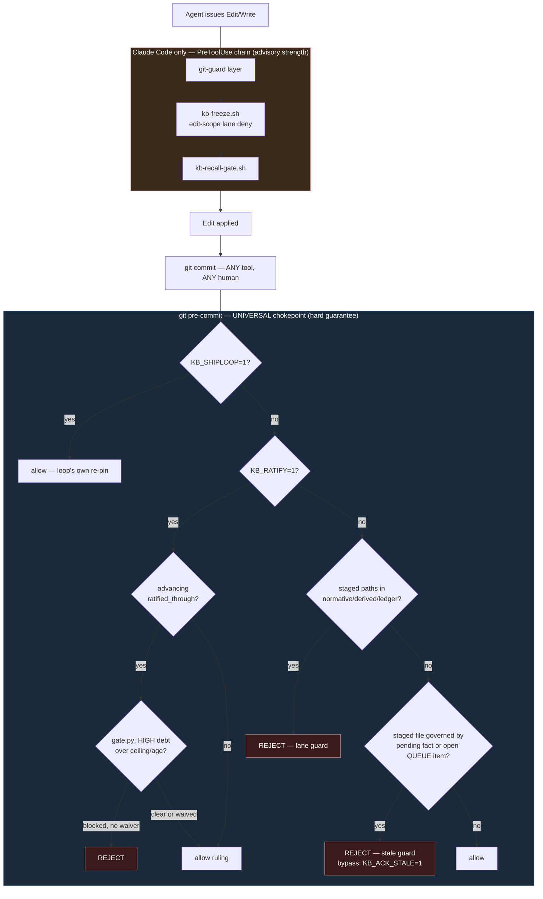
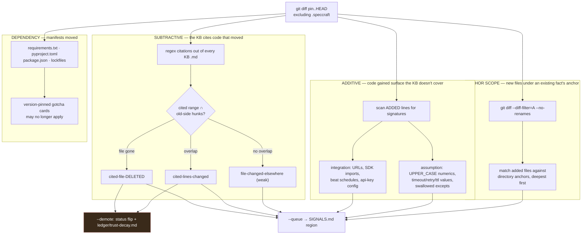
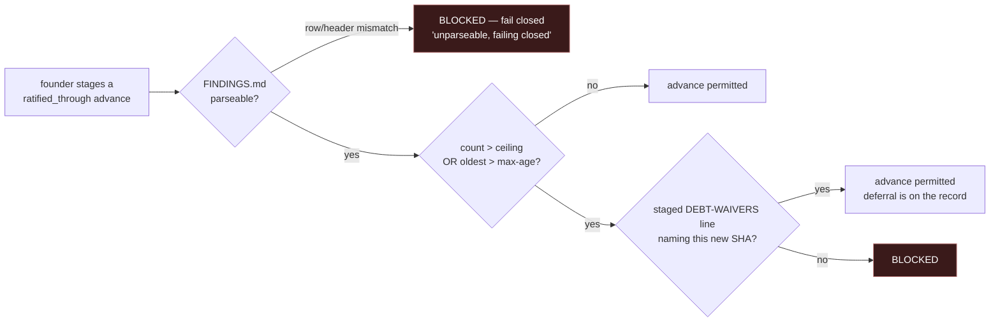

# speccraft — System Design

**Status:** Living document, describes shipped behavior as of `speccraft-cli` 0.7.1
**Audience:** Engineers extending or evaluating speccraft; reviewers assessing whether the guarantees hold
**Scope:** The whole system — data model, control planes, enforcement, failure modes, and the places it breaks

This document describes what is *built*, not what is aspired to. Where the implementation
diverges from the intent, the divergence is stated. Where a guarantee is weaker than it
appears, the weakness is named. Sections marked **⚠ Known limitation** are not roadmap
items dressed as caveats — they are current, load-bearing gaps.

---

## 1. The problem

A coding agent pointed at a mature repository has no access to the single most valuable
artifact in the codebase: **the reasoning that produced it**. It can read every line and
still not know that the retry count is 3 because the upstream provider rate-limits at 4,
that a duplicated helper exists because the "obvious" shared one has a subtle bug, or that
a module looks over-engineered because it survived an incident.

The industry's answer has been retrieval — embed the repo, search it semantically, stuff the
results in context. This fails in a specific and predictable way: **retrieval over code
returns code.** The judgment was never written down, so no retrieval system can return it.
What comes back instead is plausible-looking precedent, which the agent then extends. The
codebase converges toward whatever pattern is most textually common, not whatever pattern is
correct.

The second-order failure is worse. An agent that cannot see intent will *invent* it, and its
inventions are indistinguishable in form from facts. Confabulated architecture rationale reads
exactly like real architecture rationale. Once that text lands in a doc, the next agent
retrieves it as ground truth. The knowledge base poisons itself, and every subsequent decision
inherits the poison.

speccraft exists to make judgment a **first-class, trust-graded, drift-detected artifact that
lives in the repository and is enforced at the git chokepoint.**

### 1.1 The three failure modes it targets

| Failure | Mechanism | speccraft's answer |
|---|---|---|
| **Confabulation** — the agent invents rationale and it becomes canon | No provenance distinction between "founder said" and "model guessed" | A trust lattice where machine-derived, human-elicited, and agent-inferred facts are structurally separate lanes, and only a human can promote |
| **Drift** — the KB describes a codebase that no longer exists | Docs decay silently; nothing links a claim to the code that justifies it | Every claim carries `path:line @pin`; drift is computed as a set intersection between citations and diff hunks, and stale claims are auto-demoted with a ledger entry |
| **Blind cloning** — the agent duplicates a pattern because it cannot see the canonical seam | Retrieval surfaces the most common shape, not the sanctioned one | Structural recall on anchors, plus a pre-edit gate that denies the first edit to a governed file and hands back the governing facts |

---

## 2. Goals and non-goals

### Goals

1. **Provenance is never blurred.** A reader can always tell whether a claim is mechanically
   harvested, spoken by the founder, or hypothesized by a model — and the distinction survives
   every transformation.
2. **Deterministic before generative.** Anything a regex or `git` can establish is established
   that way. Models only interpret, and their output enters as `pending-ratification`.
3. **Cite or it didn't happen.** A claim without `path:line @pin` is not a fact.
4. **One artifact.** The KB is a tracked directory inside the product repo. One clone carries
   code and judgment; one commit can land both; git history *is* the audit ledger.
5. **Harness-agnostic enforcement.** Guarantees must hold for Claude Code, Codex, OpenCode, and
   a human at a terminal — which means they must live below the agent layer.
6. **Trust falls mechanically, rises only by human ruling.** Demotion is automatic and evidence-backed;
   promotion requires a founder decision recorded as a commit.

### Non-goals

- **Not a RAG system.** No embeddings, no vector store, no similarity ranking. Retrieval is
  structural and deterministic. This is a deliberate trade — see §9.1.
- **Not a linter.** `check.py` runs deterministic checks, but speccraft does not attempt to
  judge code quality. It judges whether code matches *recorded intent*.
- **Not multi-tenant, not a service.** Laptop scale, single product, single founder-adjudicator.
  Everything runs locally with zero infrastructure. See §8 for where this assumption breaks.
- **Not a defense against a hostile agent.** The threat model is a *well-meaning confabulator*,
  not an adversary. See §7.3 — this is the most important limitation in the document.
- **Not an LLM harness.** speccraft has zero runtime dependencies and makes no model calls.
  Agents call *it*.

---

## 3. Architecture

### 3.1 Planes

speccraft separates into four planes with sharply different trust and determinism properties.
Nothing in the deterministic plane can hallucinate; nothing in the generative plane can commit
a ratified fact.



The critical structural property: **the arrow from GENERATIVE to STATE does not exist.**
Agents reach state only through the enforcement plane, and the enforcement plane refuses
the founder lanes unless a human sets `KB_RATIFY=1`.

### 3.2 Physical layout

The KB is a tracked directory *inside* the product repo. This is the decision everything
else hangs off (§9.2).

```
<product>/
├── .speccraft/
│   ├── kbforge.yaml              # repo path, components, risk_paths, thresholds
│   ├── KB-STATUS.md              # agent-agnostic briefing, regenerated on change
│   ├── QUEUE.md                  # THE adjudication queue — human questions
│   ├── SIGNALS.md                # mechanical projection: drift / deps / advisories
│   ├── QUEUE-ARCHIVE.md          # resolved signals, age-trimmed
│   ├── findings/FINDINGS.md      # bug/work table; open HIGH rows gate ratification
│   ├── ledger/
│   │   ├── DIV-*.md              # ruled divergences: intent ≠ code
│   │   ├── trust-decay.md        # every auto-demotion, with evidence
│   │   └── DEBT-WAIVERS.md       # append-only authorizations to ship past HIGH debt
│   ├── kb/
│   │   ├── derived/              # machine-harvested; regenerated wholesale; never hand-edited
│   │   │   └── inventory.md      # ← carries BOTH anchors (§5)
│   │   ├── normative/            # elicited intent, invariants, CONV-NN-*.md conventions
│   │   ├── inferred/             # agent hypotheses, status=pending-ratification
│   │   └── decisions/            # ADR-lite lane (planned, not yet populated)
│   └── evals/telemetry.jsonl     # append-only event log, self-trimming at 5 MB
├── AGENTS.md                     # delimited speccraft section; CLAUDE.md imports via @AGENTS.md
├── .claude/ .agents/ .opencode/  # installed procedure mirrors
└── .git/hooks/{pre,post}-commit  # the chokepoint — does NOT survive clone
```

---

## 4. The trust lattice

Every fact carries a `status` in its frontmatter. Status is not decoration — it is the sort key
for retrieval, the gate condition for pre-edit denial, and the target of automatic demotion.



### 4.1 Retrieval rank

`recall.py` sorts strictly by this table. The numbers matter: the pre-edit gate fires only on
rank ≤ 1, so a demoted fact stops blocking edits the moment evidence contradicts it — the system
degrades toward permissiveness, not toward false confidence.

| Rank | Status | Gate fires? | Meaning |
|---|---|---|---|
| 0 | `ratified` | ✅ | Founder-granted, binding |
| 1 | `ratified-partial`, `ruled` | ✅ | Partially granted, or a ledger ruling |
| 2 | `observed` | ❌ | Mechanically true at the pin |
| 3 | `pending-ratification` | ❌ | Agent hypothesis — informative, not binding |
| 4 | `challenged` | ❌ | Contradicted by evidence; do not rely |
| 9 | unknown | ❌ | Unparseable status; treated as least trusted |

### 4.2 `external` sub-grading

External knowledge (dependency gotchas, CVEs) is sub-graded by source, because "the docs say"
and "the model thinks" are not the same claim:

- `external:doc` — official documentation URL, version-scoped
- `external:advisory` — CVE / GHSA identifier
- `external:model-prior` — LLM-supplied, **UNVERIFIED**, never trusted until ratified

**Hard rule: a gotcha is sourced or it is marked unverified. Never invented.** External cards are
version-pinned; a dependency bump challenges the cards attached to it.

---

## 5. The two-anchor design

This is the most important mechanism in the system and the one most often misread as redundancy.

`kb/derived/inventory.md` carries **two** commit anchors serving orthogonal purposes:

- **`source_commit`** — the *mechanical pin*. What the harvesters read at, and what `drift.py`
  diffs the working tree against. Advanced by `seed0.py` on **every** ship-loop run, **ungated**.
- **`ratified_through`** — the *trust boundary*. "The KB is reviewed-and-clean through here."
  Advanced **only** by a founder ratification, and **refused** while HIGH debt exceeds policy.



**Why they must be separate.** If there were one anchor, you would have to choose between two
broken systems:

- *Gate the only anchor* → the pin stalls behind unreviewed debt, drift is computed against an
  ancient commit, and the diff grows without bound until every citation looks stale. Drift
  detection becomes useless precisely when you need it most.
- *Ungate the only anchor* → the KB silently claims currency it has not earned. "Pinned at HEAD"
  reads as "reviewed through HEAD" and nothing distinguishes harvested-but-unexamined from
  founder-approved.

Two anchors let the mechanical layer stay current (drift stays cheap and precise) while the trust
layer stays honest (the distance between the anchors *is* the review backlog, and it is visible
in the briefing banner as "N commit(s) unreviewed").

The pin deliberately excludes the KB's own commits:

```
git log -1 --format=%h -- . ':(exclude).speccraft'
```

Without this, the ship loop's own `kb:` commit would advance the pin, `pin == HEAD` would hold
permanently, and **nothing would ever be flagged as drifted**. This one pathspec is what keeps
the loop from silently self-satisfying.

---

## 6. Control planes

### 6.1 Write path — the ship loop

Fires from `post-commit` in the product repo. **Order is load-bearing:** `drift.py` must run
against the OLD pin before `seed0.py` re-pins, or the diff is empty and every drift signal is lost.



Three guards keep this from eating itself:

| Guard | Implementation | Prevents |
|---|---|---|
| Self-recursion | `git diff-tree` — skip if the commit touched only `.speccraft/` | Infinite loop from the loop's own `kb:` commit |
| Worktree isolation | skip when `--git-dir != --git-common-dir` | Linked worktrees racing the main tree |
| Burst collapse | `mkdir` lockfile (atomic on POSIX) | A rebase or rapid commits spawning N concurrent loops |

### 6.2 Read path — structural recall

`recall.py` is the anti-RAG. Every fact declares `anchors:` — path prefixes and `topic:` slugs
naming the loci it governs. Given what you're about to touch, recall returns exactly the facts
filed at those loci, trust-ordered.

The match rule is **bidirectional prefix**: a fact matches if an input file starts with one of its
anchors, *or* an anchor starts with an input path. The second direction is what makes passing a
directory recall the facts anchored to files inside it.



**The no-coverage warning is a feature, not an error path.** A retrieval system that returns
"nothing relevant" is usually considered to have failed. Here it is the highest-value output:
it means the agent is about to build on unmapped ground, and it should elicit intent rather
than infer it.

`recall.py` has four modes beyond the default report, all consumed by hooks:

| Mode | Exit contract | Consumer |
|---|---|---|
| `--gate-check` | 3 if any rank ≤ 1 fact matches | `kb-recall-gate.sh` — pre-edit deny |
| `--no-coverage-check` | 3 if NO fact in ANY lane covers the files | Confusion Protocol branch |
| `--coverage-count` | prints `<covered> <total>` | `pre-commit` recall-eligible telemetry |
| `--harness <name>` | tags the `recall_ran` event | Cross-harness adoption measurement |

### 6.3 Enforcement — layered chokepoints

Guarantee strength decreases from left to right. The design principle: **put the strongest
guarantee at the layer every actor must pass through**, and treat everything above it as
advisory.



**Write-lane permission matrix:**

| Lane | Agent | Ship loop | Founder |
|---|---|---|---|
| product code | ✅ | ❌ (never touches code) | ✅ |
| `kb/inferred/` | ✅ propose | ❌ | ✅ |
| `QUEUE.md` | ✅ append | ✅ | ✅ |
| `findings/FINDINGS.md` | ✅ append as `proposed` | ❌ | ✅ confirm |
| `kb/derived/` | ❌ | ✅ regenerate wholesale | ✅ |
| `kb/normative/` | ❌ | ❌ | ✅ `KB_RATIFY=1` |
| `ledger/` | ❌ | ✅ `trust-decay.md` only | ✅ |

### 6.4 The recall gate and the injection lesson

`kb-recall-gate.sh` denies the *first* edit to a governed file per session, returning the
governing facts in the deny reason. Deny-once (cached at `$TMPDIR/speccraft-recall-seen-<sid>`)
is a deliberate throughput/assurance trade: block forever and the agent stalls; block once and
it re-issues the edit having read the facts.

Two branches, in precedence order:

1. **Ratified match** — `recall.py --lanes normative --gate-check` exits 3.
2. **Confusion Protocol** — the path matches `risk_paths` in `kbforge.yaml` *and* no fact in any
   lane covers it. The agent is told: *do not guess-and-clone; a canonical seam may exist that
   you cannot see from here.* This inverts the usual gate logic — it fires on **absence** of
   knowledge in a high-stakes region.

The deny text embeds a hard-won finding, recorded in the source itself:

> Deny wording is the empirically validated v3 template: briefing reference + verifiable KB paths
> + divergence rule — **coercive variants get classified as prompt injection and ignored.**

This generalizes to a principle worth stating explicitly, because it is not obvious:
**any control-plane text an agent reads is itself an injection surface, and the agent's own
injection defenses will fire on your control plane if it sounds like an attacker.** Legitimate
system messages must be verifiable (point at real files the agent can read) rather than
authoritative-sounding. An imperative "YOU MUST NOT" reads like an attack; "here are the facts,
here are the paths, verify them" reads like infrastructure.

---

## 7. Drift detection

`drift.py` is the system's immune response. It computes four independent signals across the
`pin..HEAD` diff.



**Subtractive** is exact: a set intersection between cited line ranges and diff hunks on the
pinned side. No heuristics, no false confidence.

**Additive and anchor-scope are heuristic** and should be read as such. Additive is a regex
signature scan capped at 40 findings per aspect. Anchor-scope depends on `--no-renames` being
load-bearing — with rename detection on, a file *moved into* an anchored scope shows as `R` and
is missed entirely; decomposing renames puts the add side where it belongs.

### 7.1 Demotion policy

Trust decay is asymmetric by design: **it falls mechanically, on evidence, with a ledger entry;
it rises only through a human.** The policy differs by lane because the lanes mean different things:

| Lane | `cited-file-DELETED` | `cited-lines-changed` | Rationale |
|---|---|---|---|
| `inferred` / `decisions` | → `challenged` | → `challenged` | A hypothesis whose evidence moved is no longer supported |
| `normative` | → `challenged` | founder-adjudicated (queued) | A ratified fact citing a nonexistent file is *the KB lying* — that is mechanical. But moved lines may not invalidate intent, so a human rules |
| `derived` | never touched | never touched | Regenerated wholesale on the next re-pin |

Demotion **never modifies content** — one `status:` flip plus a `status_note`, reversible by
exactly one human action. The evidence goes to `ledger/trust-decay.md` with a `reverse-by:` line.

### 7.2 SIGNALS.md as a projection

Mechanical findings do not accumulate in the adjudication queue. `signals.py` owns
`SIGNALS.md` as three fenced regions (`drift`, `deps`, `advisories`), each replaced **whole**
on every run. This makes it a *projection of current state* rather than an event log:

- **Dedup is free** — re-running produces the same region, not duplicate entries.
- **Decay is free** — a fixed finding simply vanishes from the next projection.
- **Resolution is derivable** — the writer diffs the previous region against the new one and
  archives the difference as `- resolved <date>: ...`.

This is the difference between a queue and a projection, and it is why `decay.py` shrank to a
single job (age-trimming the archive). Human adjudication items in `QUEUE.md` are never
auto-cleaned — they are the questions the queue exists for, and they age *visibly*.

### 7.3 ⚠ Known limitation — the enforcement boundary is an environment variable

`KB_RATIFY=1 git commit` is the founder's authority. It is also a string any agent with shell
access can prepend to a command.

The pre-commit guard reliably prevents **accidental** writes to founder lanes — an agent
following instructions, or one that simply stages the wrong file. It does **not** prevent a
capable agent from self-ratifying if it decides to. Nothing in the system cryptographically
binds a ratification to a human.

This is stated plainly because the alternative — implying the guarantee is stronger than it is —
would be worse than the gap itself. The honest characterization: **speccraft prevents drift and
accident; it does not prevent defection.** For the current threat model (a well-meaning
confabulator, single-founder repo) that is the right trade — the cost of real authority binding
is signed commits plus an out-of-band approval path, which would break the "zero infrastructure"
property that makes the rest of the system adoptable.

If the threat model changes — multiple contributors, agents running unattended, compliance
requirements — this is the first thing that must be rebuilt. Candidate: require ratification
commits to be GPG-signed by a key the tooling does not have access to, and verify the signature
in `pre-commit` rather than trusting an env var.

Two smaller instances of the same class:

- `git commit --no-verify` bypasses every hook. Universal to all git-hook-based tooling.
- Git hooks **do not survive `git clone`**. A fresh clone is completely unguarded until
  `session-kit/install.sh` re-arms it. Tracked artifacts (skills, `AGENTS.md`, OpenCode
  commands) *do* travel — so a cloned repo *tells* the agent about rules it cannot enforce.

---

## 8. The debt forcing function

`gate.py` is the single source of debt policy, consumed by three callers (pre-commit
enforcement, briefing banner, ratify flow) so the number can never disagree with itself.

It parses `findings/FINDINGS.md` as a markdown table, counts rows with `sev=HIGH` and
`status ∈ {proposed, confirmed}`, and refuses a `ratified_through` advance when:

- open HIGH count **>** `high_debt_ceiling` (default 3), **or**
- the oldest open HIGH is **>** `high_debt_max_age_days` old (default 14), by its `Raised` date



Two properties worth calling out:

**It fails closed.** A misaligned table row raises, and the verdict becomes
`{"blocked": True, "count": -1}`. A corrupted debt ledger blocks ratification rather than
silently reporting zero debt. Given that agents append rows to this file, corruption is a
*likely* event, not a theoretical one — and the safe direction is unambiguous.

**The escape hatch is on the record.** `--waive "reason"` appends to `ledger/DEBT-WAIVERS.md`
and stages it; pre-commit then looks for a staged waiver line naming the *specific* new
`ratified_through` SHA. You cannot waive in advance, and you cannot waive silently. The waiver
is a git-tracked artifact naming what was deferred and why.

### 8.1 ⚠ Known limitation — the founder is the throughput bottleneck

The system's steady-state capacity is bounded by human rulings per day, and every mechanism
above *increases* the ruling load: drift queues items, demotion creates re-verification work,
anchor-scope drift fires on every new file under a broad anchor.

The failure mode is a ratchet: high code churn → mass demotion → review backlog grows →
`ratified_through` stalls → the gap between anchors widens → HIGH debt ages past 14 days →
ratification blocks → the KB is now both stale *and* locked. Nothing in the current design
detects or dampens this loop.

Partial mitigations that exist: the deny-once cache, `ADD_CAP=40`, the projection model
(fixed findings vanish rather than requiring dismissal), and the fact that weak
`file-changed-elsewhere` findings are spot-check-only. Mitigations that do **not** exist:
any prioritization of the queue, any batching, any measure of adjudication latency, or any
back-pressure signal when the backlog is growing faster than it is being drained.

`evals/telemetry.jsonl` records the raw material to study this (`recall_eligible`, `auto_demote`,
`stale_warn`) but nothing currently computes the derivative.

---

## 9. Design decisions and alternatives considered

### 9.1 Structural anchors over embedding retrieval

**Chosen:** facts declare `anchors:`; retrieval is exact prefix matching, sorted by trust.

**Rejected:** embed the KB, retrieve by cosine similarity.

| | Structural | Embedding |
|---|---|---|
| Determinism | Same query → same result, forever | Drifts with model, index, chunking |
| Auditability | "Why did this return?" has a one-line answer | Requires similarity-score forensics |
| Precision at the seam | Exact — the fact governs *that path* | Approximate — returns things that *sound* related |
| No-coverage detection | **Exact and load-bearing** | Impossible — always returns the top-k nearest, so "nothing here" is unrepresentable |
| Recall of unanchored knowledge | ❌ Misses facts nobody anchored | ✅ Finds textually related content |
| Runtime cost | Zero deps, no index, no API | Index build, embedding calls, storage |

The decisive factor is the fourth row. A system whose primary safety mechanism is *"this region
has no recorded intent — stop and elicit"* cannot be built on a retriever that always returns
its nearest neighbors. Similarity search structurally cannot say "nothing." Anchoring buys that
at the cost of requiring humans to declare scope — which is the same cost as writing the fact
down at all.

**Consequence accepted:** anchors are coarse. A fact anchored at `backend/` matches every backend
file and the gate fires broadly; deny-once bounds the annoyance but not the noise. Per-symbol
anchoring would be more precise and much more brittle under refactoring. Not yet resolved.

### 9.2 KB inside the product repo, not beside it

**Chosen:** `<product>/.speccraft/`, tracked.

**Rejected:** a sibling `<product>-kb/` repo; a central service; a database.

The in-repo choice buys four things that are individually nice and jointly decisive:

1. **One clone carries both.** No sync protocol, no "which KB version matches this code" problem.
2. **git history becomes the audit ledger for free.** Every ruling is a commit with an author,
   a timestamp, and a diff. No separate audit system exists or needs to.
3. **Code and the judgment that shaped it can land atomically** in one commit.
4. **Branches and merges work.** The KB forks with the feature branch.

The costs are real and mostly unpaid so far: `.speccraft/` noise in every `git log` (mitigated by
`git log -- ':(exclude).speccraft'`), and the pin needing the `':(exclude).speccraft'` pathspec
everywhere so the KB's own commits don't move it — a subtlety that has to be right in several
places at once.

### 9.3 Git hooks as the enforcement layer

**Chosen:** `pre-commit` / `post-commit` in the product repo.

**Rejected:** MCP server; per-harness plugins; a filesystem watcher; CI-only enforcement.

Git is the **only chokepoint every actor passes through** — Claude Code, Codex, OpenCode, a
human, a script, CI. Everything above it is per-harness and therefore optional. The design
consequence is stated in the spec as: *"Instruction conflicts in prose can degrade compliance,
never correctness."* Prose in `AGENTS.md` is advisory; the hook is not.

**Consequence accepted:** hooks don't survive clone (§7.3), `--no-verify` bypasses them, and the
whole layer is shell — which is where the portability cost landed (§10).

### 9.4 Markdown files as the database

**Chosen:** frontmatter + markdown tables, hand-editable.

**Rejected:** SQLite, JSON, a real schema.

Markdown is diffable, reviewable in a PR, editable by a human without tooling, and readable by an
agent with no client library. The KB must be *human-adjudicated*, and adjudication in a diff is
the entire audit story.

**Consequence accepted, and it is not small:** parsing is homegrown. `recall.frontmatter()` is a
deliberately partial YAML parser (scalars + one-level lists + flow lists) and `check.py` must read
`avoid_pattern:` **raw**, bypassing that parser, because the `#`-splitting comment strip would
corrupt a regex containing `#`. `gate.py` hand-parses a markdown table and fails closed on
misalignment. Every one of these is a place where a valid-looking edit produces a subtly wrong
parse. The mitigation is fail-closed behavior where it matters most, not parser correctness.

### 9.5 Trust falls mechanically, rises only by human

**Chosen:** asymmetric transitions — automatic demotion, manual promotion.

**Rejected:** symmetric automation (auto-re-promote when citations re-verify).

Auto-promotion would reintroduce exactly the failure the system exists to prevent: a machine
deciding that a claim is trustworthy. The asymmetry means the worst case of a bug in drift
detection is *over*-demotion — noisy, recoverable, one human action to reverse — rather than
false confidence, which is silent and compounds.

---

## 10. Portability

The engine is 13 Python files (pure stdlib, no runtime dependencies). The orchestration is 23
shell files. That split is the portability story: **the part that computes is portable; the part
that glues is not.**

| Requirement | macOS / Linux | Windows | Notes |
|---|---|---|---|
| `git` | ✅ | ✅ | Hard requirement — the product is git-native |
| Python ≥ 3.9 | ✅ | ⚠ | Windows ships `python`, not `python3`; the Store alias is a broken stub. Mitigated in 0.7.1 by pinning `SPECCRAFT_PYTHON=sys.executable` |
| `bash` | ✅ built in | ⚠ via Git for Windows | 0.7.1 resolves `bash.exe`, preferring Git for Windows over `System32\bash.exe` (the WSL launcher, which cannot see `C:/...` paths) |
| `jq` | usually | ❌ typically absent | Only used to merge Claude hook settings; degrades to a "merge by hand" notice rather than failing the install |
| Symlinks | ✅ | ⚠ needs Developer Mode | Falls back to a directory junction (`mklink /J`), which needs no privileges |
| Git hooks | ✅ | ✅ | Git for Windows runs hooks through its own bundled `sh.exe` — no bash on `PATH` required |
| Claude live hooks | ✅ | ❓ **unverified** | `session-kit/settings.json` registers hook commands as bare `~/.speccraft/kb-forge/.../kb-*.sh` paths. Whether Windows Claude Code can execute a `.sh` — and expand `~` — is the same class of problem `cmd_init` hit, and has not been tested. If it cannot, the entire Claude-only advisory layer (briefing, recall gate, freeze) is silently absent on Windows while the git chokepoint keeps working |

### 10.1 ⚠ Known limitation — the bash dependency is an implementation artifact

Nothing in `kbforge-init.sh` requires a shell. It makes directories, copies files, and calls four
Python programs in order — all of which Python does natively and more portably. The Windows
fixes in 0.7.1 (bash discovery, path normalization, interpreter pinning, junction fallback) all
exist to make a shell script survive a hostile environment. Porting the init path to Python
deletes all four at once and reduces the Windows requirement to *git only*, matching macOS and
Linux.

The same argument applies to `session-kit/install.sh`, where the `jq` dependency would be
replaced by the `json` module.

The git hooks are a genuinely different case and should stay shell: git invokes them directly,
Git for Windows supplies the interpreter, and rewriting them in Python would add process startup
cost to every commit.

---

## 11. Scale analysis

Complexity, with F = KB facts, C = citations, D = changed files, A = added lines, S = staged files.

| Operation | Cost | Trigger frequency | Comfortable ceiling |
|---|---|---|---|
| `recall.py` (any mode) | O(F) walk + frontmatter parse | Every `--files` call; **per edit** under PostToolUse | ~10³ facts |
| `drift.py` subtractive | O(F × C) regex + O(C × hunks) intersect | Every commit | ~10³ facts × ~10 cites |
| `drift.py` anchor-scope | O(F × added-files) | Every commit | fine unless a commit adds 10⁴ files |
| `gate.py` | O(rows in FINDINGS.md) | Every ratify + every briefing | trivial |
| `pre-commit` stale guard | O(S × (pending-facts + queue-items)) in **awk/sh** | Every commit | ~10² staged files |
| Ship loop end-to-end | Sum of all harvesters over the repo at the pin | Every code commit, backgrounded | seconds on a laptop repo |

**Where it breaks first:** `recall.collect()` re-walks and re-parses the entire KB on *every*
invocation, and the Claude PostToolUse hook invokes it after *every* Edit/Write. At a few hundred
facts this is milliseconds. At 10⁴ facts in a monorepo, an interactive agent session pays that
walk hundreds of times. The fix is a cached anchor index invalidated by mtime — deliberately not
built, because the current deployment target is one product on one laptop and the index would be
the first thing to go stale and lie.

**Second bottleneck:** the `pre-commit` stale guard is nested shell loops over awk output —
O(staged × pending × anchors) in a language with no data structures. A 500-file commit against a
KB with many pending facts will be visibly slow.

**Not a scale problem, a correctness problem:** the ship loop runs detached with output to
`$TMPDIR/kb-shiploop.log`, and its final commit is `|| true`. A harvester that starts crashing
produces no user-visible signal — the KB simply stops updating while every banner continues to
report the last good state. There is no health check. This is the single most likely way for the
system to fail silently in production, and it currently has no mitigation.

---

## 12. Failure modes

| # | Failure | Detection | Behavior | Assessment |
|---|---|---|---|---|
| F1 | `FINDINGS.md` corrupted by an agent's malformed row | Cell/header count mismatch | **Fail closed** — ratification blocked | ✅ Correct direction |
| F2 | Ship loop crashes mid-run | None | Silent; KB stops updating, banners still show stale-but-plausible state | ❌ **Unmitigated** (§11) |
| F3 | Stale lockfile after SIGKILL | None | `mkdir` never succeeds again → ship loop permanently dead, silently | ❌ **Unmitigated** — `trap EXIT` does not cover SIGKILL |
| F4 | Fresh clone, hooks not installed | None automatic | All guarantees silently absent while `AGENTS.md` still advertises them | ⚠ `install.sh` exists; nothing prompts you to run it |
| F5 | `recall.py` broken / KB unreadable | Hook checks exit code | **Fails open** — edits allowed | ✅ Correct for an advisory layer; availability over enforcement |
| F6 | Freeze lane file missing | Absence check | **Fails open** — all edits allowed | ⚠ Correct default for an opt-in feature, but a *failed* freeze is indistinguishable from *no* freeze |
| F7 | Drift over-demotes after a large refactor | Visible in `ledger/trust-decay.md` | Mass `challenged` → review backlog | ⚠ Recoverable but can trigger the §8.1 ratchet |
| F8 | Two harnesses commit concurrently | Lockfile | Second loop skipped; next commit catches up | ✅ Convergent |
| F9 | Non-ASCII in KB or filenames on Windows | Exception at write/print | Crash — locale-default encoding is cp1252 | 🔧 Under repair |
| F10 | Agent sets `KB_RATIFY=1` itself | None | Self-ratification succeeds | ❌ **Accepted** — see §7.3 |

The pattern across F1/F5/F6 is a coherent policy worth naming: **fail closed on trust, fail open
on availability.** Anything that could let unvouched state be recorded as vouched blocks; anything
that merely helps the agent degrades to permissive. F2 and F3 are the two places where the policy
isn't implemented — both fail *silent*, which is the one option that is never right.

---

## 13. Open questions

1. **Anchor granularity.** Directory prefixes over-match; symbol anchors under-survive
   refactoring. Is there a middle representation — anchoring to a symbol *with* a path fallback?
2. **Backlog back-pressure.** What is the right signal when adjudication is falling behind
   generation (§8.1)? A ratio in the briefing? A refusal to queue more of the same class?
3. **Heuristic quality.** The additive-drift and assumption-residue regexes have never had
   precision/recall measured against a labeled corpus. The `evals/` scaffold exists; the corpus
   does not.
4. **Multi-developer.** `QUEUE.md`, `FINDINGS.md`, and `SIGNALS.md` are single files with a single
   assumed writer. Concurrent branches will conflict. Region-fencing helps within a machine and
   not at all across branches.
5. **Authority binding.** If the threat model outgrows §7.3, what is the least-infrastructure path
   to real ratification authority? Signed commits verified in `pre-commit` is the obvious answer;
   it costs the zero-setup property.
6. **Ship-loop observability.** F2 and F3 both need a health check. Where does it surface —
   the briefing banner, a `speccraft doctor` command, or a staleness assertion in `pre-commit`?

---

## Appendix A — Component reference

| Component | Role | LLM? |
|---|---|---|
| `seed0.py` | Harvest routes, models, tests, churn, module map w/ risk tags; **sets the pin** | no |
| `assume0.py` | Harvest decision residue: TODO/HACK, swallowed excepts, frozen constants, timing values, reverts | no |
| `dup0.py` | Duplicate/contradiction candidates (ast + regex) + ruff F/B/S at the pin | no |
| `deps0.py` | Dependency inventory + pinned versions; security scanners on a 7-day cadence riding commit activity | no |
| `dep-diff.py` | Correlate manifest version changes against version-pinned gotcha cards | no |
| `drift.py` | Four-signal drift vs pin; `--demote` executes trust decay | no |
| `decay.py` | Age-trim `QUEUE-ARCHIVE.md` (`queue_archive_days`, default 30) | no |
| `recall.py` | Structural retrieval + the four hook exit contracts; owns `frontmatter()` and telemetry | no |
| `gate.py` | Single source of HIGH-debt policy: verdict, banner, waiver | no |
| `check.py` | Convention grep-bans + custom `CHK-NN-*.sh`; lenient/strict with per-check opt-in | no |
| `signals.py` | Region-fenced projection writer for `SIGNALS.md` | no |
| Agent passes | Archaeology / interview / confrontation / extraction | **yes** |

## Appendix B — Procedures

Single-sourced from `session-kit/skills/*/SKILL.md`, installed to `.claude/skills/`,
`.agents/skills/` (the Agent Skills standard — Codex and OpenCode read it natively),
`.opencode/commands/`, and `~/.codex/prompts/`.

| Procedure | Purpose |
|---|---|
| `speccraft-recall` | Ground the task; interpret trust classes; stop on no-coverage |
| `speccraft-decide` | ADR-lite capture at decision time |
| `speccraft-diverge` | File a conflict between intent and request — **never self-ratify** |
| `speccraft-ratify` | Founder ruling session; commits with `KB_RATIFY=1` |
| `speccraft-freeze` | Orchestrator confines a sub-agent's edits to an assigned lane |

## Appendix C — Telemetry events

Append-only at `.speccraft/evals/telemetry.jsonl`; self-trims to the last 10,000 lines past 5 MB.
Fire-and-forget — telemetry never breaks the operation that emitted it.

| Event | Emitter | Measures |
|---|---|---|
| `recall_ran` | `recall.py`, tagged by `--harness` | Adoption, per harness |
| `recall_eligible` | `pre-commit` | Denominator: staged files that *had* coverage |
| `recall_gate_block` | `kb-recall-gate.sh` | Ratified-fact denials |
| `recall_gate_nocoverage` | `kb-recall-gate.sh` | Confusion Protocol denials |
| `guard_commit_block` | `pre-commit` | Lane-guard rejections |
| `stale_guard_block` / `stale_warn` / `stale_ack` | `pre-commit` | Stale-governance pressure and bypass rate |
| `ratify_used` | `pre-commit` | Founder rulings |
| `auto_demote` | `drift.py` | Trust decay volume |
| `queue_archive_trim` | `decay.py` | Archive hygiene |

The `recall_ran / recall_eligible` pair is the designed-in adoption metric: what fraction of
edits to covered files were actually grounded first. It is deliberately an upper-bound proxy —
sessionless and harness-independent — because the alternative required per-harness instrumentation
that Codex and OpenCode do not expose.

---

## Appendix D — Configuration

`.speccraft/kbforge.yaml`:

| Key | Default | Effect |
|---|---|---|
| `repo` | — | Absolute path to the product repo |
| `risk_paths` | — | Regex; matching paths trigger the Confusion Protocol when uncovered |
| `high_debt_ceiling` | `3` | Max open HIGH findings before `ratified_through` advance is refused; `0` = zero tolerance |
| `high_debt_max_age_days` | `14` | Any open HIGH older than this refuses the advance |
| `queue_archive_days` | `30` | Retention for resolved signal lines |
| `check_mode` | `lenient` | `strict` makes every check build-failing |

Environment overrides:

| Variable | Effect |
|---|---|
| `KBFORGE_HOME` | Where hooks find the forge (default `~/.speccraft/kb-forge`) |
| `SPECCRAFT_BASH` | Explicit bash interpreter (Windows escape hatch) |
| `SPECCRAFT_PYTHON` | Interpreter the forge scripts invoke; pinned by the CLI |
| `SPECCRAFT_FREEZE` | Space-separated path prefixes bounding a sub-agent's edits |
| `KB_RATIFY=1` | Founder ratification — unlocks founder lanes |
| `KB_SHIPLOOP=1` | The loop's own re-pin commit — short-circuits `pre-commit` |
| `KB_ACK_STALE=1` | Bypass the stale-commit guard (recorded as telemetry) |
